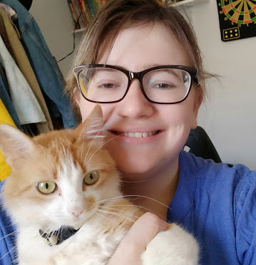

🇺🇸

# Codes and project developed in the first class of the online course "eu progr{amo}" of progr{a}maria

> ⚠️ This repository uses the **brasilian portuguese** language in some parts of the code and and the README. Get in touch if you have any questions.

The online course **eu progr{amo}** it's for woman who want's to learn programming from the scratch. I recommend it for a person who doesn't know nothing about Computer Science and programming. The course goal is to create a secure community of woman driven by technology and sorority. You're going to learn basic aspects about Computer Networks, `HTML`, `CSS` and `JavaScript`. In this repository are the project developed on the course.

> Visit if you want to know more about the course and [progr{a}maria](https://www.programaria.org/curso-online-euprogramo/) 🚀

## Project Status

### ✅ Done ✅

## Project

> ⚠️ It's not totally equal to the proposed project, I've changed some colors, but it's a basic HTML page.

## To-do List

- [x] Base HTML
- [x] CSS Style
- [x] JavaScript for form

***

## Author

<b>Isabella de Freitas Nunes</b>  
A girl who loves teaching and learning algorithms, theory of computation and coding.

Get in touch! 👋

***

🇧🇷

# Códigos e Projeto desenvolvido na primeira turma do curso online eu progr{amo} da progr{a}maria

> ⚠️ Este repositório usa o **português brasileiro** em algumas partes do código e no README. No caso de dúvidas entre em contato.

## Visite se quiser saber mais sobre o curso e a [progr{a}maria](https://www.programaria.org/curso-online-euprogramo/) 🚀

O curso online **eu progr{amo}** é voltado para as mulheres que querem iniciar a caminhada na programação. Recomendo para quem não tem nenhum conhecimento de Ciência da Computação e programação, excelente opção para iniciar do zero. O objetivo do curso também é criar uma comunidade de mulheres movidas pela tecnologia e sororidade. São apresentados conceitos básicos de Redes, `HTML`, `CSS` e `JavaScript`. Neste repositório está o projeto desenvolvido no curso.

## Status do projeto

### ✅ Concluído ✅

## Projeto

> ⚠️ Não está exatamente igual ao que foi desenvolvido no curso visto que modifiquei alguns elementos.

## A fazer

- [x] Base HTML
- [x] Estilo CSS
- [x] JavaScript para o formulário

***

## Autora

<b>Isabella de Freitas Nunes</b>  
Uma menina que gosta de ensinar e aprender algoritmos, teoria da computação e programação.

Vamos conversar! 👋

